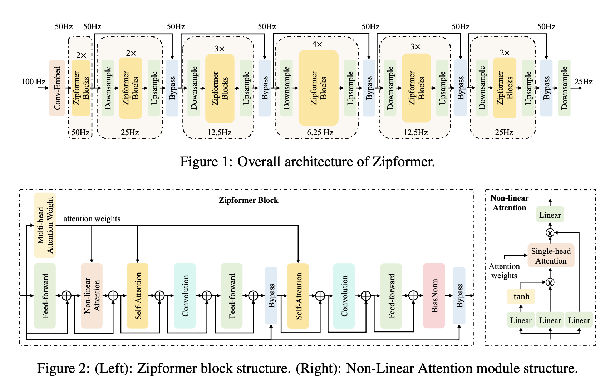

</img>

## Zipformer

Implementation of the U-Net like Zipformer from the <a href="https://arxiv.org/pdf/2310.11230">Zipformer</a> paper, for improving the Conformer with better temporal resolution.

## Usage

1 Zipformer Block

```python
import torch
from zipformer import ZipformerBlock

block = ZipformerBlock(
    dim = 512,
    dim_head = 64,
    heads = 8,
    mult = 4
)

x = torch.randn(32, 100, 512) #[batch_size,num_time_steps,feature_dim]

block(x) # (32, 100, 512)
```

Zipformer - just multiple `ZipformerBlock` from above

```python
import torch
from zipformer import Zipformer

zipformer = Zipformer(
    dim = 512,
    depth = 12,          # 12 blocks
    dim_head = 64,
    heads = 8,
    mult = 4,
)

x = torch.randn(32, 100, 512)

zipformer(x) # (32, 100, 512)
```

## Todo

- [ ] switch to a better relative positional encoding.
- [ ] whitener and balancer activation modifications.
- [ ] adding a training and evaluation script.

## References
1. [lucidrains/conformer](https://github.com/lucidrains/conformer/tree/master)
2. [facebookresearch/ConvNext](https://github.com/facebookresearch/ConvNeXt/blob/main/models/convnext.py)
3. [k2-fsa/icefall](https://github.com/k2-fsa/icefall/blob/master/egs/librispeech/ASR/pruned_transducer_stateless7/zipformer.py) 

## Contribution
Please give a pull request,I will be happy to improve this naive implementation.

## Citations

```bibtex
@misc{@article{yao2023zipformer,
  title={Zipformer: A faster and better encoder for automatic speech recognition},
  author={Yao, Zengwei and Guo, Liyong and Yang, Xiaoyu and Kang, Wei and Kuang, Fangjun and Yang, Yifan and Jin, Zengrui and Lin, Long and Povey, Daniel},
  journal={arXiv preprint arXiv:2310.11230},
  year={2023}
}
```